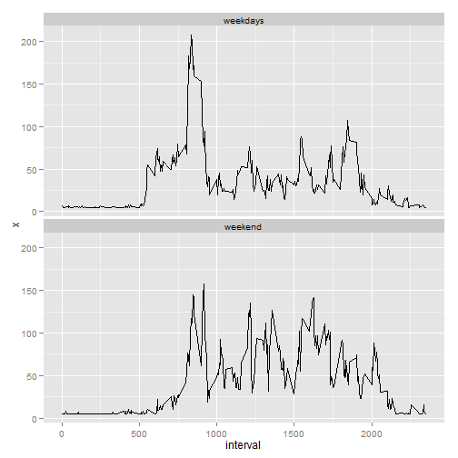

## Load libraries and set global defaults.


```r
##Load any required libraries and set any global defaults
if (!require("knitr"))
        {
                install.packages("knitr")
        }

if (!require("ggplot2"))
        {
                install.packages("ggplot2")
        }

if (!require("Hmisc"))
        {
                install.packages("Hmisc")
        }

# Turn off scientific notations for numbers
options(scipen = 999)  

#Set globals
opts_chunk$set(fig.width=7, fig.height=7, warnings=FALSE)  
Sys.setlocale("LC_ALL", "English") 
```

```
## [1] "LC_COLLATE=English_United States.1252;LC_CTYPE=English_United States.1252;LC_MONETARY=English_United States.1252;LC_NUMERIC=C;LC_TIME=English_United States.1252"
```

```r
#Set working directory to data directory
setwd('C:/Users/bryan_000/Documents/GitHub/Data/')
```

## Loading and preprocessing the data

The variables included in this data set are:

        steps: Number of steps taking in a 5-minute interval (missing values are coded as NA)

        date: The date on which the measurement was taken in YYYY-MM-DD format

        interval: Identifier for the 5-minute interval in which measurement was taken

```r
if (!file.exists("activity.csv"))
 {
        data.url <- 'http://d396qusza40orc.cloudfront.net/repdata%2Fdata%2Factivity.zip'
        zip.file <- 'activity.zip'
        download.file(data.url, zip.file) 
        unzip(zip.file)
 }

##Read the data
data <- read.table("activity.csv", header = TRUE, sep =",")
```

The data set is stored in a comma-separated-value (CSV) file.

        There are a total of 17568 observations in this data set.  
        There are a total of 2304 days/intervals with missing values in this data set.

## What is mean total number of steps taken per day?

For this part of the assignment, missing values in the data set will be ignored. For step 1, I prepared a Histogram of the total number of steps taken each day

```r
totalsteps <- with(data, rowsum(steps, date))

#plot the histogram
hist(totalsteps, breaks=8, col="blue", main="Total Steps Histogram", xlab="Steps")
```

 

For the second part, I calculated the mean and median total number of steps taken per day (ignoring missing values).  The mean number of steps is 10766.19 and the median number of steps is 10765.

## What is the average daily activity pattern?


I calculated the aggregation of steps by intervals of 5-minutes and saved them in a data frame called stepsperint. I then plotted the average number of steps taken (averaged across all days) versus the 5-minute intervals.

```r
## Calcutae mean steps per Interval for plotting
stepsperint<- aggregate(data$steps,by = list(interval = data$interval), FUN=mean, na.rm="TRUE")

##Plot 
with(stepsperint, plot(interval, x, type="l", col="red"))
```

 

Next, I computed the 5-minute interval with the containing the maximum number of steps.

```r
maxnumsteps <-stepsperint[which.max(stepsperint[,2]),]
```

On average, the interval 835 was the 5-minute interval which contained the maximum number of steps 206.

## Imputing missing values

There are many days/intervals where there are missing values (coded as NA). The presence of missing days may introduce bias into some calculations or summaries of the data.  This data set had `r sum(is.na(data$steps))' days/intervals with missing values.  I copied the original data set to a new data set and added a column "imputed_steps" and filled the missing values with the mean value.

```r
impdata <-data
impdata$imputed_steps<-with(impdata, impute(steps,mean))
```

The data set with the missing steps imputed had 0 days/intervals with missing values.

Now, using the data set with the missing steps imputed, I made a histogram of the total number of steps taken each day and calculated the mean and median total number of steps.

```r
imptotalsteps <- with(impdata, rowsum(imputed_steps, date))

#plot the histogram
hist(imptotalsteps, breaks=8, col="blue", main="Total Steps Histogram After NA Imputed", xlab="Steps")
```

 

##Differences

The mean number of steps calculated with the imputed values was 10766.19 and the median number of steps was 10766.19.  The mean and median previously calculated by ignoring the NA values were 10766.19 and 10765 respectively.   

##Impact of imputing missing data

The mean was unchanged by imputing the missing values using the mean value for the 5 minute interval.  The median increased slightly to match the mean. As expected, the frequencies of each bin were higher with the imputed missing data.

## Are there differences in activity patterns between weekdays and weekends?

I conducted this analysis using the data set with missing values imputed.  I made a plots containing average number of steps taken on weekdays and weekends.

```r
impdata$week <- factor(weekdays(as.Date(data$date)) %in% c("Saturday", "Sunday"), c("FALSE", "TRUE"), c("weekdays", "weekend"))

stepsperint<- aggregate(impdata$imputed_steps, by = list(interval=impdata$interval, week=impdata$week), FUN = mean, na.rm = TRUE)

##Plot the output
ggplot(stepsperint, aes(x = interval, y = x)) + geom_line() + facet_wrap(~week, ncol=1)
```

 

The graph above that activity on the weekday has the greatest peak from all steps intervals. The weekends activities has more peaks over a hundred than the weekday activities. 
